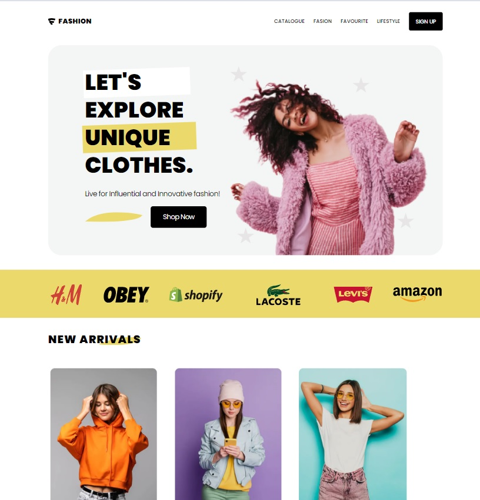
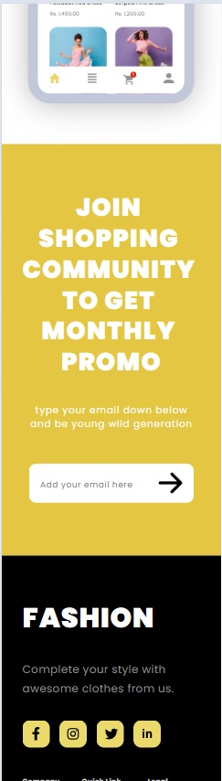

# FASHION 

Fashion Landing Page - это проект, разработанный для изучения и применения передовых технологий веб-разработки. Этот лендинг представляет собой онлайн магазин молодежной одежды, разработанный с использованием различных технологий и подходов.

Посетите [FASHION](https://do6roetyro.github.io/fashion_website/) для просмотра приложения в действии.

## Установка

Для запуска приложения локально выполните следующие шаги:

1. Убедитесь, что у вас установлен Node.js и npm.
2. Склонируйте репозиторий с помощью команды `git clone`.
3. Перейдите в каталог проекта и выполните `npm install` для установки зависимостей.
4. Запустите приложение с помощью `npm run serve`.
5. Откройте ваш браузер и перейдите по адресу `http://localhost:9000`.

## Технологии

- SCSS (Sass): Проект использует препроцессор SCSS для более удобного и организованного написания CSS. SCSS позволяет использовать переменные, миксины, вложенные стили и другие возможности, что делает код более модульным и легко поддерживаемым.

- Pug (Jade): Для HTML разметки используется шаблонизатор Pug (ранее известный как Jade). Pug упрощает написание HTML кода за счет уменьшения количества скобок и улучшения читаемости кода.

## Адаптивность

Дизайн лендинга полностью адаптивен и оптимизирован для всех устройств и разрешений экрана (от 320px до 4К). Использованы медиа-запросы и Flexbox CSS + clamp() для того, чтобы обеспечить оптимальное отображение на различных устройствах, включая мобильные телефоны, планшеты и настольные компьютеры.

## Семантика и доступность
Уделено особое внимание семантике HTML и структуре документа, чтобы обеспечить понятность содержания и улучшить индексацию сайта поисковыми системами (практика применения schema.org). Кроме того, я следовал принципам доступности, чтобы сайт был доступен для всех пользователей, включая людей с ограниченными возможностями.

## Скриншоты

## Авторы

- Мастяев Алексей;

## Контакты

- **VK:** [vk.com/go6poeytpo](https://vk.com/go6poeytpo)
- **Яндекс:** [do6roeytro@yandex.ru](mailto:do6roeytro@yandex.ru)
- **GMail:** [warm.citrus@gmail.com](mailto:warm.citrus@gmail.com)
- **Telegram:** [t.me/Do6poeytpo](https://t.me/Do6poeytpo)